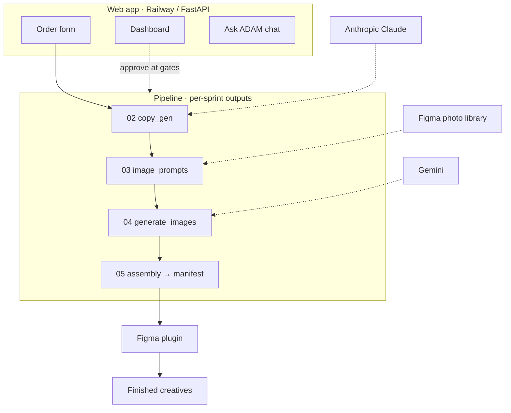

# Architecture

How the pieces fit together, end to end. For *where the files are*, see [Repo map](03-repo-map.md).

## The five components

| # | Component | Lives in | Runtime | Role |
|---|---|---|---|---|
| 1 | **Web app** | `main.py` + `agent/` | Railway (FastAPI) | Serves the order form, sprint dashboard, and the AI chat; kicks off pipeline runs |
| 2 | **Pipeline** | `pipeline/run_pipeline.py` | Python (local or in the web app) | The brain: copy-gen → imagery → manifest, gated in 6 stages |
| 3 | **In-app chat** | `agent/orchestrator.py` | Railway (part of the web app) | Claude tool-use loop over sprints + learnings — "ask ADAM anything" |
| 4 | **Figma plugin** | `plugin/` | Figma desktop (manual) | Clones templates and fills copy/images into named layers |
| 5 | **MCP connector** | `mcp_server/` | Mounted in the Railway web app at `/mcp` | Exposes the 7 pipeline tools to claude.ai as a connector, reading the live `runs` dir (replaced the old standalone Fly server) |

> **Source of truth for pipeline logic is `pipeline/run_pipeline.py`.** The numbered stage files
> (`00_intake.py` … `06_deliver.py`) are an older AWS-bound scaffold that lags behind it.

## Data flow (happy path)



The same flow, in ASCII detail:

```
   ┌─────────────┐   order.json    ┌──────────────────────────────────────┐
   │ Order form  │ ───────────────▶│  run_pipeline.py  (per-sprint state)  │
   │ (web app)   │                 │                                       │
   └─────────────┘                 │  00 intake     → order.json           │
                                   │  01 load_refs  → context.json         │
   ┌─────────────┐                 │  02 copy_gen   → copy_outputs.json  ◀─ Claude
   │ Sprint      │ ◀── inspect ────│  03 image_prompts → prompts OR photo pick
   │ dashboard   │                 │  04 gen_images → images/  ◀────────────── Gemini
   │ + AI chat   │ ── approve ────▶│  05 assembly   → asset_manifest.csv   │
   └─────────────┘   (gates)       │  06 deliver    → run_summary.json     │
                                   └───────────────────┬──────────────────┘
                                                       │ asset_manifest.csv
                                                       ▼
                                          ┌────────────────────────┐
                                          │ Figma plugin (manual)  │
                                          │ clones template/row,   │
                                          │ fills copy + image     │
                                          └────────────┬───────────┘
                                                       ▼
                                            Finished creatives → Paid Acq team
```

Everything for one run lives under `runs/{sprint_id}/`.

## Where imagery comes from (the fork in stage 03/04)
- **Library photo** — for styles that show real people, the pipeline looks up a **rights-cleared, tagged
  photo** from Upwork's Figma library (`pipeline/figma_library.py`). No image is generated.
  *(Hard rule: no AI-generated photos of people — see [Constraints](10-constraints.md).)*
- **Gemini image** — for illustration / abstract / background styles, stage 04 generates a PNG.
- **Skip image** — some styles (Pie Chart, Us vs Them, Text Only, UI mockups…) are pure layout/text and
  skip imagery entirely.

The plugin mirrors this with a `STYLES_THAT_SKIP_IMAGE` table — see [Figma plugin](05-figma-plugin.md).

## The gate model
Six human checkpoints; humans approve via the dashboard/chat (`approve_gate` tool) or the CLI
(`--resume SPRINT_ID --gate N`). Order → order+refs confirm → copy review → image-prompt scan →
image+assembly review → final QA. Details in [The pipeline](04-the-pipeline.md).

## Deployment topology
- **Railway** runs the web app (FastAPI from `main.py`), auto-deploying from GitHub `loganheath-oss/adam`.
- **Secrets** (Anthropic, Gemini, Figma, Google) are Railway env vars — see [Deployment & ops](08-deployment-and-ops.md).
- **Figma plugin** runs locally in Figma desktop against the "Paid Acquisition 2026" file
  (`DoDwumxELkuAuKKSP5p00e`).
- **Historical:** Fly (old MCP host), Replit (`replit-poc/`, retired), AWS/Terraform (dormant).
