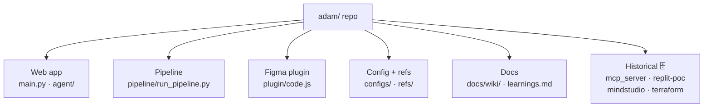

# Repo map

Where every piece lives. ✅ = live/current, 🟡 = supporting, 🗄️ = historical/dormant.



```
adam/
├── main.py                  ✅ Web app entry (FastAPI): order form, dashboard, pipeline runner, chat mount
├── agent/                   ✅ The in-app AI assistant ("ask ADAM anything")
│   ├── orchestrator.py        Claude tool-use loop + the 13 tools (sprints, gates, learnings…)
│   ├── routes.py              /chat router (GET chat UI, POST chat)
│   ├── chat_ui.html           Standalone chat page
│   ├── sprint_chat_ui.html    Per-sprint chat (gate orchestration)
│   └── sprint_finals_ui.html  Per-sprint finals view
├── pipeline/                ✅ The pipeline
│   ├── run_pipeline.py        ★ SOURCE OF TRUTH for current logic (copy-gen, gates, manifest)
│   ├── figma_library.py       Tag-based, rights-checked photo lookup in the Figma file
│   ├── build_refs.py          Compiles refs/*.txt → configs/refs_context.json
│   ├── 00_intake.py … 06_deliver.py   🗄️ Older AWS-bound stage scaffold (lags run_pipeline.py)
│   ├── inspect_templates.py   Dev tool: dump template/layer names from Figma
│   └── test_new_styles_routing.py   Dev test: style→template routing
├── plugin/                  ✅ Figma assembly plugin (runs in Figma desktop)
│   ├── code.js                Plugin logic: template auto-discovery, per-row clone + fill
│   ├── manifest.json          Figma plugin manifest
│   ├── ui.html                Plugin UI (capture/destination/CSV/assemble)
│   ├── library_tagger/        Tooling to tag library photos
│   ├── tag_manager/           Tooling to manage tags/rights
│   └── README.md              Install + use instructions
├── configs/                 ✅ Compiled/config data
│   ├── upwork_config.json     Drive folder IDs, Figma file ID, channel specs
│   ├── template_registry.json Style → template mapping + per-template rules (can drift; plugin is name-driven)
│   └── refs_context.json      Compiled brand/legal/performance context (~140 KB) — DON'T hand-edit
├── refs/                    ✅ Raw reference docs (brand voice, legal, claims, KOTH perf, tags)
├── order-form/              ✅ HTML order forms (local + hosted) + fonts
├── runs/                    ✅ Per-sprint outputs: runs/{sprint_id}/ (order.json, copy_outputs.json, manifest, images…)
├── docs/                    ✅ Documentation
│   ├── wiki/                  ★ THIS WIKI
│   ├── architecture_and_logging.md   Infra deep-dive (where things run, what's logged)
│   ├── demo_prompts.md        Demo walkthroughs
│   └── elise_figma_comments_responses.md   Elise's Figma feedback + answers
├── learnings.md             ✅ Institutional memory the chat reads every session (/learnings page)
├── CLAUDE.md                🟡 Original master spec — decisions/constraints still good; status section is stale
├── README.md                🟡 One-liner repo readme
├── mcp_server/              ✅ MCP tools (server.py) — mounted into the web app at /mcp (live claude.ai connector); fly.toml = retired standalone host
├── scripts/                 🟡 git-credential + post-merge hooks
├── sync_from_github.sh      🟡 Sync helper · sync_log.jsonl is its log
├── replit-poc/              🗄️ Retired Replit proof-of-concept
├── mindstudio/              🗄️ Retired MindStudio flow (do not reintroduce)
├── terraform/               🗄️ Dormant AWS scaffolding (Logan has no apply access; no native AWS allowed)
├── attached_assets/         🗄️ Misc attachments
├── pyproject.toml · uv.lock 🟡 Python project/deps
└── runs_demo_order.json     🟡 Demo order used to exercise copy-gen on the new styles
```

## The "what do I edit?" cheat-sheet
| I want to… | Edit |
|---|---|
| Change pipeline logic / gates / copy prompt | `pipeline/run_pipeline.py` |
| Add/adjust a Figma template or visual style | `plugin/code.js` lookup tables (+ a Figma template) |
| Change brand voice / claims / references | `refs/*.txt` then run `pipeline/build_refs.py` |
| Change Drive folders / Figma file / channels | `configs/upwork_config.json` |
| Teach the AI a durable lesson | `learnings.md` (or the `/learnings` page) |
| Change the order form | `order-form/*.html` |
| Change the chat assistant's tools/behavior | `agent/orchestrator.py` |

> ⚠️ **Never hand-edit `configs/refs_context.json`** — it's compiled from `refs/`. Edit the raw refs and
> re-run `build_refs.py`.
