# The pipeline

The pipeline lives in **`pipeline/run_pipeline.py`** — the source of truth for current logic. It runs as
six stages with **human gates** between them. State for each run lives in `runs/{sprint_id}/`.

## Stages → gates at a glance

```mermaid
flowchart LR
  O["Order"] --> G1{{"Gate 1<br/>submitted"}}
  G1 --> S1["01 load_refs"] --> G2{{"Gate 2<br/>order + refs"}}
  G2 --> S2["02 copy_gen"] --> G3{{"Gate 3<br/>copy review"}}
  G3 --> S3["03 image_prompts"] --> G4{{"Gate 4<br/>prompt scan"}}
  G4 --> S4["04 generate_images"] --> G5{{"Gate 5<br/>images + assembly"}}
  G5 --> S5["05 assembly"] --> G6{{"Gate 6<br/>final QA"}}
  G6 --> S6["06 deliver"]
```



> Hexagons are **human gates**; rectangles are automated **stages**. Gate 2 is the last free checkpoint (no API spend before it).

## Stages

| Stage | Module / function | Produces | Notes |
|---|---|---|---|
| 00 intake | order parse | `order.json`, sprint ID | From the order form, a CSV, or `--test` |
| 01 load_refs | `stage_01` | `context.json` | Compiled brand + legal + performance refs (from `refs_context.json`) |
| 02 copy_gen | `stage_02_copy_gen` → `_generate_real_copy` | `copy_outputs.json` | Claude writes **6 concepts/style**, self-scores, picks top 3 |
| 03 image_prompts | `stage_03` | `image_prompts.csv` **or** photo selections | Gemini prompts **or** a rights-cleared library photo pick |
| 04 generate_images | `stage_04` | `images/*.png` | Gemini PNGs; **skipped** for library-fed and skip-image styles |
| 05 figma_assembly | `stage_05` | `asset_manifest.csv` | The handoff to the Figma plugin |
| 06 deliver | `stage_06` | `run_summary.json` | Drive upload + notification (delivery format still being finalized) |

## The 6 gates
Humans approve between stages. Approve via the dashboard/chat (`approve_gate`) or CLI:

```bash
# Start a run (pauses at Gate 2)
python3 pipeline/run_pipeline.py --json runs_demo_order.json
# or:  --csv order.csv   |   --test  (built-in test order)

# Resume after each approval
python3 pipeline/run_pipeline.py --resume SPRINT_ID --gate 2   # order + refs confirmed → runs copy-gen
python3 pipeline/run_pipeline.py --resume SPRINT_ID --gate 3   # copy approved → image prompts
python3 pipeline/run_pipeline.py --resume SPRINT_ID --gate 4   # prompts approved → generate images
python3 pipeline/run_pipeline.py --resume SPRINT_ID --gate 5   # images approved → assembly/manifest
python3 pipeline/run_pipeline.py --resume SPRINT_ID --gate 6   # final QA approved → deliver
```

Gates don't block on stdin — each stage **saves state and returns**; you resume with the next `--gate`.

| Gate | Checkpoint | Why it matters |
|---|---|---|
| 1 | Order submitted | The form click is the approval |
| 2 | Order + refs confirmed | **Last free checkpoint** — no API credits spent yet |
| 3 | Copy review | Edit/approve concepts before spending image credits |
| 4 | Image-prompt scan | Sanity-check prompts before generation |
| 5 | Image + assembly review | Review generated imagery + the manifest |
| 6 | Final QA | Sign-off before delivery |

> The current 6-gate model assumes AI image generation; library-fed sprints make gates 4–5 thin. A 5-gate
> redesign is proposed but **not** done — don't refactor mid-sprint. See [Decisions log](15-decisions-log.md).

## Copy generation details
- Calls Anthropic `/v1/messages` directly (model `claude-sonnet-4-*`) via `httpx`.
- Builds a rich prompt from `refs_context.json`: brand voice, writing style, compliance, approved claims,
  copy bank, targeting-specific examples, and the **order brief (highest priority)**.
- **Multi-field styles** get extra structured fields in the prompt + return keys:
  - **Us vs Them** → `us_headline`, `them_headline`, `us_bullets[3]`, `them_bullets[3]`
  - **Sticky Note** → `left_headline`, `right_headline`, `left_bullets[2]`, `right_bullets[2]`
  - **Pie Chart** → a `%` extracted from the concept (`_extract_chart_pct`) into `Chart_Pct`
- Output is reviewed/ranked by a second Claude pass (`_review_and_rank_copy`) that scores all 6 and selects top 3.

## The manifest (the handoff artifact)
`asset_manifest.csv` is what the Figma plugin reads. One row per asset, with columns the plugin maps to
template layers: `Visual_Style`, `Resolutions`, `Headline`, `CTA`, `Description`, plus the multi-field
columns (`Chart_Pct`, `Us_Headline`, `Them_Bullets`, `Left_Bullets`, …) and optional `figma_node_id` /
`template_frame_id`. See [Figma plugin](05-figma-plugin.md) for how each column is consumed.

## Known blocker
Copy-gen currently returns **HTTP 400 "credit balance is too low"** — the Anthropic key has no credits.
See [Troubleshooting](11-troubleshooting.md). This is the single thing stopping live unique output.
