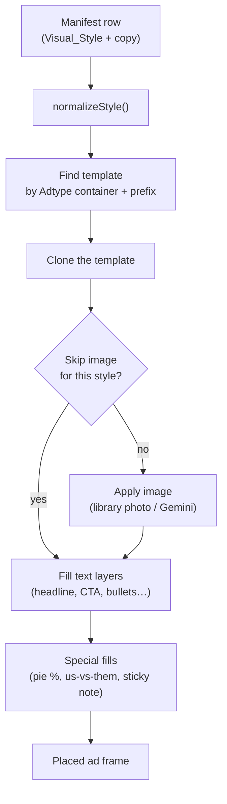

# The Figma plugin

`plugin/` — runs in **Figma desktop** against the "Paid Acquisition 2026" file
(`DoDwumxELkuAuKKSP5p00e`). It reads a manifest CSV, clones the right template per row, and fills copy +
imagery into named layers.

## How one manifest row becomes an ad

## Install
1. Figma desktop → **Plugins → Development → Import plugin from manifest…**
2. Select `plugin/manifest.json`.
3. It appears as **Upwork Pipeline Assembly** under Plugins → Development.

> **Editing the plugin does NOT update it live.** After any `code.js` change, you must **reload** the
> plugin in Figma desktop (re-run it; if it was relinked, re-import the manifest). There is no hot reload.

## Run it (current, auto-discovery flow)
1. Open the Figma file (any page — discovery is now document-wide).
2. Run **Upwork Pipeline Assembly**.
3. Click **Choose CSV file…** and load a manifest (`runs/{sprint_id}/asset_manifest.csv`, or a test CSV).
4. Click **Assemble**.

Each assembled ad is a **standalone frame at its native size** (e.g. 1440×1440), laid out in a 4-wide grid
near your viewport. They are **not** nested into a parent frame unless you capture a **destination** first
(optional Step 2).

## Template auto-discovery (no "pick a template")
`code.js` finds templates automatically — you don't choose, and you don't have to be on the right page:
- `findTemplatesRoot()` scans **all pages**, prefers the page named like a *Template Library*, falls back
  to whichever page has `Template_*` frames, and otherwise searches the **whole document** (`figma.root`).
- For each manifest row, `findStyledTemplate()` scopes by the style's **Adtype container** first (so shared
  base skeletons don't collide), then widens.
- Capture Template still exists as an optional override for other modes, but isn't needed here.

## How a style maps to a template
The plugin is **config-driven** by lookup tables in `code.js` (keyed by normalized style name):

| Table | Purpose |
|---|---|
| `STYLE_TEMPLATE_PREFIXES` | Which `Template_*` frame(s) a style uses |
| `STYLE_ADTYPE_CONTAINERS` | The `Adtype:` container to scope the search to |
| `STYLE_HEADLINE_LAYERS` | Candidate layer names for the headline |
| `STYLE_BULLET_LAYERS` | Bullet layer names (e.g. Us-vs-Them) |
| `STYLE_SUBHEAD_LAYERS` | Subhead/stat layer names |
| `STYLES_THAT_SKIP_IMAGE` | Styles that keep template imagery (no image override) |
| `STYLES_THAT_SKIP_CTA` | Styles whose CTA layer is intentionally not filled |
| `STYLE_VARIANT_PREFERENCES` | Which component-set variant to prefer (e.g. Light Mode) |

`normalizeStyle(s)` lowercases and strips parentheticals, so `"Pie Chart (data)"` → `pie chart`.

## The 21 templates
All 21 ad-type templates on the ⚙️ Template Library page are recognized and assemble (verified: 21/21,
0 failures). Special fills:
- **Pie Chart** → sets the center callout text + the value arc (`arcData` on the ELLIPSE) from `Chart_Pct`.
- **Us vs Them** → fills us/them headlines + 3 bullets each.
- **Sticky Note** → fills two structured columns (left/right headline + 2 bullets each).
- **Reminder / Tweet-Post Mockup** → share a base; primary notification layer fills.

## Known field-coverage gaps (cosmetic, tracked)
- **Pie Chart** quadrant labels share one layer name → need distinct names + 4 copy fields.
- **Photo with Text** subhead doesn't fill in the Light-Mode variant (variant lacks the layer).
- A few styles need real Figma-side layer renames before 100% field coverage.

These are *fill-completeness* polish, not recognition failures — see [Troubleshooting](11-troubleshooting.md).
