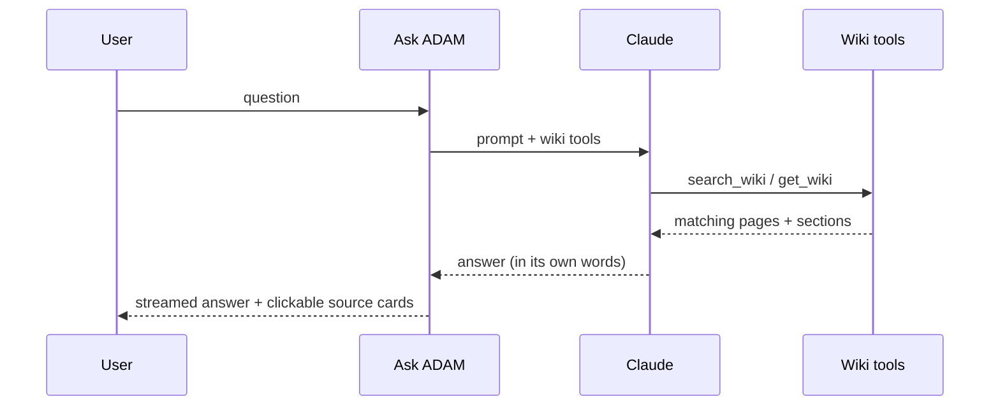

# The web app & chat

`main.py` is a **FastAPI** app (deployed on Railway) that ties the human-facing surfaces together:
the order form, a sprint dashboard, the pipeline runner, and the **in-app AI chat**.

## What the web app does
- Serves the **order form** (from `order-form/`).
- Runs the **pipeline** (`pipeline/run_pipeline.py`) for a submitted order.
- Provides a **sprint dashboard** to inspect runs and drive gates.
- Mounts the **chat** at `/chat` (`agent/routes.py`), behind an API-key dependency (`require_api_key`).
- Exposes a **`/learnings`** page to edit `learnings.md` in the browser.

## How the chat answers (with sources)

## The chat — "ask ADAM anything"
`agent/orchestrator.py` is a **Claude tool-use loop**. It can read sprints, references, copy, manifests,
and learnings, and (with approval) edit orders and approve gates. The tools it has:

| Tool | What it answers / does |
|---|---|
| `list_sprints` | What runs exist |
| `get_sprint` | Status + metadata for one sprint |
| `get_copy_concepts` | The generated copy for a sprint |
| `get_image_prompts` | Image prompts / photo picks |
| `get_references` | The brand/legal refs used |
| `get_manifest` | The assembly manifest |
| `edit_order` | Change an order (gated) |
| `approve_gate` | Advance a sprint through a gate |
| `get_chat_history` / `get_gate_decisions` | Audit trail for a sprint |
| `search_past_sprints` | Find prior runs by query |
| `get_learnings` / `append_learning` | Read/append institutional memory |

It reads [`learnings.md`](../../learnings.md) every session, so durable guidance there shapes its answers.

## Making the wiki answerable (the handoff goal)
Today the chat is **sprint-aware** but not **wiki-aware** — it can tell you about *runs*, not about *how
ADAM is built*. To deliver "ask the tool any question and get an answer," wire the wiki in as a knowledge
source. Options, smallest → biggest:

1. **Seed learnings** — add a pointer block to `learnings.md` summarizing the wiki + linking pages. Cheapest;
   immediately improves answers. *(Good first step.)*
2. **Add a `get_wiki` / `search_wiki` tool** to `orchestrator.py` that reads `docs/wiki/*.md` so the chat
   can quote exact pages. *(Recommended — makes answers grounded and citable.)*
3. **Retrieval** over the wiki + refs for larger corpora later.

> Recommended path: do (1) now, implement (2) as the first enhancement after a funded key is in place.

## Auth
The chat router is mounted with `require_api_key`. Keep the app's API key in Railway env. Production
hardening (real OAuth, per-user audit) is pending and owned by Upwork eng — see [Constraints](10-constraints.md).
