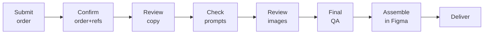

# Using ADAM (operator runbook)

> **Looking for just your part?** Three people share this workflow and each needs a different
> slice: [Paid Acquisition](17-role-paid-acquisition.md) (order form only) ·
> [Copywriter](18-role-copywriter.md) (running the gates) ·
> [Designer](19-role-designer.md) (Figma assembly + templates).
> This page is the complete end-to-end runbook behind all three.

End-to-end: from a brief to finished creatives. Two ways to drive it — the **web app** (normal) or the
**CLI** (power users / debugging).

## The operator's path



## A) The normal flow (web app)
1. **Submit an order** in the order form: platform, format, quantity, **visual styles**, **resolutions**,
   and a **brief** (the brief is the highest-priority instruction — it overrides standing refs).
2. **Gate 2 — confirm order + refs.** Last checkpoint before any API spend.
3. **Gate 3 — review copy — PICK YOUR WINNERS.** Claude generated 6 concepts/style and pre-picked its top picks (min 2 per style, quantity-driven, diversity-filtered), but the human chooses what ships: open the sprint's **Copy review** page, toggle concepts on/off, **Save picks**, then approve the gate. **Only selected concepts get images, manifest rows, and Figma boards** — nothing reaches Figma that wasn't chosen here. **You can also do this in chat** (2026-09-01): tell it which concepts to keep/drop (it saves via `select_copy_concepts`) and ask for copy changes — shorten a headline, fix a CTA — which it applies via `edit_copy`. **After Gate 3 approval, copy is frozen** for the run (image prompts are built from it).
4. **Gate 4 — scan image prompts** (thin for library-fed and skip-image styles: `figma_library` rows show a photo pick instead of a prompt, and `skip` rows say outright that the style's template imagery is used by design).
5. **Gate 5 — review images + the preliminary manifest.** The manifest now exists AT the gate (before 2026-09-01 it was only written after approval, so it always looked empty here). Row statuses: `delivered` = server-rendered file; `ready_for_figma` = normal for library-photo styles (the plugin places the photo inside Figma — not a failure); `skipped` = by design; `pending_assembly` = a REAL gap worth flagging.
6. **Gate 6 — final QA**, then deliver. After the Figma plugin runs, it reports its assembled boards back and they show up as `assembled_in_figma` + a `figma_assembly` block in the run summary.

**Flag-to-fix:** if a sprint has OPEN issues in the issues log, gate approvals pause and list them — resolve them or explicitly acknowledge to proceed (recorded in `gate_decisions.jsonl`). Nothing flagged ships silently anymore.
7. **Assemble in Figma** (see below) and hand finals to the Paid Acq team.

You can do gate approvals and questions through the **chat** (`/chat`) — e.g. *"approve gate 3 for
sprint 2026-06-…"* or *"show me the copy concepts."*

## B) The CLI flow (debugging / no web app)
```bash
cd /path/to/adam          # your local clone of loganheath-oss/adam (any machine)

# Start a run
python3 pipeline/run_pipeline.py --json runs_demo_order.json   # or --csv order.csv  or  --test

# Drive the gates (each prints a sprint ID; resume with it)
python3 pipeline/run_pipeline.py --resume SPRINT_ID --gate 2
python3 pipeline/run_pipeline.py --resume SPRINT_ID --gate 3
python3 pipeline/run_pipeline.py --resume SPRINT_ID --gate 4
python3 pipeline/run_pipeline.py --resume SPRINT_ID --gate 5
python3 pipeline/run_pipeline.py --resume SPRINT_ID --gate 6
```
Outputs land in `runs/{sprint_id}/` (`copy_outputs.json`, `asset_manifest.csv`, `images/`, …).

## Assembling the creatives (Figma)
1. Open the **Paid Acquisition 2026** Figma file (any page).
2. Run **Upwork Pipeline Assembly** (Plugins → Development).
3. **Choose CSV file…** → `runs/{sprint_id}/asset_manifest.csv`.
4. **Assemble.** Finished frames appear in a grid near your viewport.

Full plugin detail + gotchas: [The Figma plugin](05-figma-plugin.md).

## Crafting an order JSON (for `--json` / testing)
```json
{
  "delivery_date": "2026-06-26",
  "driver": "Your name",
  "targeting": "Prospecting",
  "deliverable": "images-copy",
  "brief": "Show businesses they can hire vetted freelancers in days, not weeks.",
  "batches": [
    {
      "platform": "Meta",
      "format": "Static Feed",
      "quantity": 1,
      "visual_styles": ["Pie Chart", "Us vs Them", "Text Only"],
      "resolutions": [{ "size": "1440x1440", "ratio": "1:1" }]
    }
  ]
}
```
Tip: a batch of **skip-image styles** (Pie Chart, Us vs Them, Sticky Note, Poll, Text Only) needs no Gemini
quota — the fastest way to exercise copy-gen end to end.

## Before you can get *unique* output
On the **live (Railway)** tool, copy-gen is verified live (2026-06-29; full gate flow incl. Figma manifest verified 2026-07-27). For **local** runs you need your *own* funded Anthropic key; with an empty key every ad assembles with
template placeholder text. See [Troubleshooting](11-troubleshooting.md).

## Recommended Figma setup: run from a scratch page (2026-09-03)

**Work inside the template file, on your own page.** Do not keep a copied set of templates in a
separate working file — those copies rot silently (the 2026-08-31 test file was missing Lifestyle
Photo's 4:5 size and the Us-vs-Them container entirely, which produced "1 failed, 25 misses").

Setup, once:

1. In the **ADAM 2026** file (the one holding the template pages), add a new page — call it
   anything, e.g. `Assembly` or `Sept sprints`.
2. Optional but recommended: put a **`Generated Tests`** SECTION on that page with one FRAME
   inside it as the container template. The plugin clones that frame per run, so output stacks
   neatly on your page instead of landing in the section on the Template Library page.
3. Run the plugin from that page. Nothing else needs to be on it.

The plugin finds what it needs across the file: templates from the library / platform pages, the
board master, and the output area. In every case **a copy on your current page wins**, so you can
still override any of them locally by putting one on your page.

Why this is better than a separate working file: the plugin cannot reach into a *different file*
(that would need the templates published as a Figma library — a bigger change), so a separate file
always means a hand-copied template set that drifts out of date.
