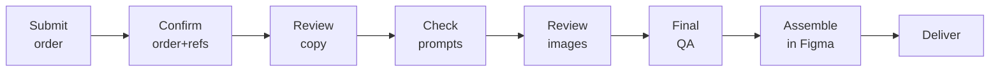

# Using ADAM (operator runbook)

End-to-end: from a brief to finished creatives. Two ways to drive it — the **web app** (normal) or the
**CLI** (power users / debugging).

## The operator's path



## A) The normal flow (web app)
1. **Submit an order** in the order form: platform, format, quantity, **visual styles**, **resolutions**,
   and a **brief** (the brief is the highest-priority instruction — it overrides standing refs).
2. **Gate 2 — confirm order + refs.** Last checkpoint before any API spend.
3. **Gate 3 — review copy.** Claude generated 6 concepts/style and picked top 3; edit or approve.
4. **Gate 4 — scan image prompts** (skipped/thin for library-fed and skip-image styles).
5. **Gate 5 — review images + manifest.**
6. **Gate 6 — final QA**, then deliver.
7. **Assemble in Figma** (see below) and hand finals to the Paid Acq team.

You can do gate approvals and questions through the **chat** (`/chat`) — e.g. *"approve gate 3 for
sprint 2026-06-…"* or *"show me the copy concepts."*

## B) The CLI flow (debugging / no web app)
```bash
cd ~/Documents/adam

# Start a run
python3 pipeline/run_pipeline.py --json runs_demo_order.json   # or --csv order.csv  or  --test

# Drive the gates (each prints a sprint ID; resume with it)
python3 pipeline/run_pipeline.py --resume SPRINT_ID --gate 2
python3 pipeline/run_pipeline.py --resume SPRINT_ID --gate 3
python3 pipeline/run_pipeline.py --resume SPRINT_ID --gate 4
python3 pipeline/run_pipeline.py --resume SPRINT_ID --gate 5
python3 pipeline/run_pipeline.py --resume SPRINT_ID --gate 6
```
Outputs land in `runs/{sprint_id}/` (`copy_outputs.json`, `asset_manifest.csv`, `images/`, …).

## Assembling the creatives (Figma)
1. Open the **Paid Acquisition 2026** Figma file (any page).
2. Run **Upwork Pipeline Assembly** (Plugins → Development).
3. **Choose CSV file…** → `runs/{sprint_id}/asset_manifest.csv`.
4. **Assemble.** Finished frames appear in a grid near your viewport.

Full plugin detail + gotchas: [The Figma plugin](05-figma-plugin.md).

## Crafting an order JSON (for `--json` / testing)
```json
{
  "delivery_date": "2026-06-26",
  "driver": "Your name",
  "targeting": "Prospecting",
  "deliverable": "images-copy",
  "brief": "Show businesses they can hire vetted freelancers in days, not weeks.",
  "batches": [
    {
      "platform": "Meta",
      "format": "Static Feed",
      "quantity": 1,
      "visual_styles": ["Pie Chart", "Us vs Them", "Text Only"],
      "resolutions": [{ "size": "1440x1440", "ratio": "1:1" }]
    }
  ]
}
```
Tip: a batch of **skip-image styles** (Pie Chart, Us vs Them, Sticky Note, Poll, Text Only) needs no Gemini
quota — the fastest way to exercise copy-gen end to end.

## Before you can get *unique* output
Copy-gen needs a **funded Anthropic key** (currently $0). With an empty key, every ad assembles with
template placeholder text. See [Troubleshooting](11-troubleshooting.md).
