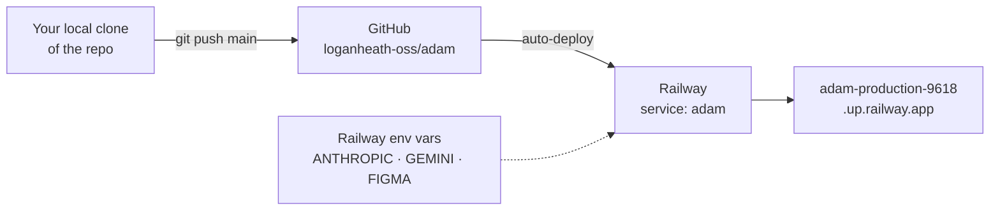

# Deployment & ops

## Deploy topology



## Where things run
| Surface | Runs on | Notes |
|---|---|---|
| Web app (order form, dashboard, chat) | **Railway** — auto-deploys from GitHub `loganheath-oss/adam` | FastAPI from `main.py` |
| Pipeline | Inside the web app, or locally via `run_pipeline.py` | Per-sprint state in `runs/` |
| Figma plugin | Figma desktop (manual) | Against file `DoDwumxELkuAuKKSP5p00e` |
| MCP server | Fly config in repo (`mcp_server/fly.toml`) | 🗄️ Historical; superseded by the web app |

> **Source of truth = GitHub `loganheath-oss/adam`.** Any local clone (on any machine) is kept in sync — there's nothing special about the original author's checkout.
> Push to `main` → Railway redeploys.

## Deploying
- **Backend (`adam` service):** push to `main` on `loganheath-oss/adam` — Railway auto-deploys from `main.py`.
- **Frontend (`adam-web` service):** does **not** auto-deploy from GitHub. Deploy it from an *isolated copy* of `web/` — never `railway up` from the repo root (that would upload the whole repo as the build context):
  ```bash
  rsync -a --delete --exclude node_modules --exclude .next web/ /tmp/adam-web-deploy/
  cd /tmp/adam-web-deploy && railway up --service adam-web --detach
  ```
- **Plugin:** not deployed — distributed as the `plugin/` folder, imported in Figma desktop. Reload after edits.
- **Roll back:** Railway dashboard → the service → **Deployments** → pick a known-good build → **Redeploy**. A failed build never takes the site down; the previous deploy keeps serving.

## Secrets / environment variables
The app needs these (set in **Railway env vars**, mirrored locally in `.env`):

| Var | Used by | Status |
|---|---|---|
| `ANTHROPIC_API_KEY` | Copy-gen + chat | ✅ Set on Railway — copy-gen **verified live**. (Local `.env` key is $0 for local dev only.) |
| `GEMINI_API_KEY` | Image generation (stage 04) | Pushed; verify quota before generating images |
| `FIGMA_ACCESS_TOKEN` | Library photo lookup (read-only) | Pushed (rotate when convenient) |
| `GOOGLE_SERVICE_ACCOUNT_JSON` | Delivery (Drive upload, stage 06) | ⏳ Not yet on Railway |
| App API key | `require_api_key` on the chat router | Keep in Railway env |

> **Secret hygiene:** never commit secrets or print full key values. Tokens pasted in chat during the build
> (Railway API token, the Figma token) should be **rotated**. Keys are read from `.env`/env, never argv.

## Gotchas (ops)
- **`runs/` lives on a persistent Railway volume** mounted at `/data/runs` (500 MB) — it survives redeploys, so
  sprints created on the deployed app persist. (On the old Fly host it was baked into the image and didn't.)
  When it fills, image stages fail with ENOSPC → use `/admin/storage` + `/admin/prune`.
- **`httpx` is required** for copy-gen; ensure it's in the deployed deps (it's used directly, not via SDK).
- **Anthropic "credit balance too low" returns HTTP 400**, not 401 — looks like a bad request but it's billing.
- **`import re` must stay imported** in `run_pipeline.py` — the multi-field/chart-pct logic needs it; a
  missing import passes `py_compile` but crashes at runtime.

## Production hardening (owned by Upwork eng, pending)
- Route LLM traffic through Upwork's **internal LLM Gateway** (alpha calls Anthropic/Gemini directly).
- Real **OAuth** + per-user **audit trail** (today it's a single shared key identity).
- Move sprint state off ephemeral storage to a DB / blob.

See [Constraints](10-constraints.md) for the hard rules behind these.
