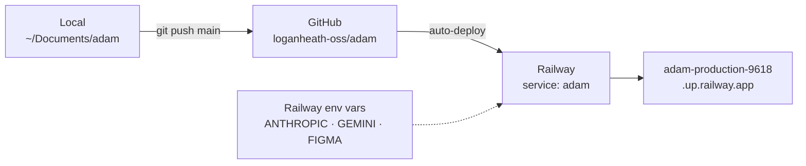

# Deployment & ops

## Deploy topology

## Where things run
| Surface | Runs on | Notes |
|---|---|---|
| Web app (order form, dashboard, chat) | **Railway** — auto-deploys from GitHub `loganheath-oss/adam` | FastAPI from `main.py` |
| Pipeline | Inside the web app, or locally via `run_pipeline.py` | Per-sprint state in `runs/` |
| Figma plugin | Figma desktop (manual) | Against file `DoDwumxELkuAuKKSP5p00e` |
| MCP server | Fly config in repo (`mcp_server/fly.toml`) | 🗄️ Historical; superseded by the web app |

> **Source of truth = GitHub `loganheath-oss/adam`.** Local `~/Documents/adam` is kept in sync.
> Push to `main` → Railway redeploys.

## Deploying
- **Code:** push to `main` on `loganheath-oss/adam`; Railway picks it up automatically.
- **Plugin:** not deployed — distributed as the `plugin/` folder, imported in Figma desktop. Reload after edits.

> TODO: confirm Railway project/service names + add the deploy dashboard link and a "how to roll back" note.
> (Provisioned this session; Railway GraphQL API at `https://backboard.railway.com/graphql/v2`.)

## Secrets / environment variables
The app needs these (set in **Railway env vars**, mirrored locally in `.env`):

| Var | Used by | Status |
|---|---|---|
| `ANTHROPIC_API_KEY` | Copy-gen + chat | ⛔ **present but $0 credits** — see Troubleshooting |
| `GEMINI_API_KEY` | Image generation (stage 04) | Pushed; verify quota before generating images |
| `FIGMA_ACCESS_TOKEN` | Library photo lookup (read-only) | Pushed (rotate when convenient) |
| `GOOGLE_SERVICE_ACCOUNT_JSON` | Delivery (Drive upload, stage 06) | ⏳ Not yet on Railway |
| App API key | `require_api_key` on the chat router | Keep in Railway env |

> **Secret hygiene:** never commit secrets or print full key values. Tokens pasted in chat during the build
> (Railway API token, the Figma token) should be **rotated**. Keys are read from `.env`/env, never argv.

## Gotchas (ops)
- **`runs/` may be baked into a deploy image** (it was on Fly) — sprints created in one place may not appear
  in another without a redeploy / shared storage. Verify the Railway volume/persistence setup. *(TODO.)*
- **`httpx` is required** for copy-gen; ensure it's in the deployed deps (it's used directly, not via SDK).
- **Anthropic "credit balance too low" returns HTTP 400**, not 401 — looks like a bad request but it's billing.
- **`import re` must stay imported** in `run_pipeline.py` — the multi-field/chart-pct logic needs it; a
  missing import passes `py_compile` but crashes at runtime.

## Production hardening (owned by Upwork eng, pending)
- Route LLM traffic through Upwork's **internal LLM Gateway** (alpha calls Anthropic/Gemini directly).
- Real **OAuth** + per-user **audit trail** (today it's a single shared key identity).
- Move sprint state off ephemeral storage to a DB / blob.

See [Constraints](10-constraints.md) for the hard rules behind these.
