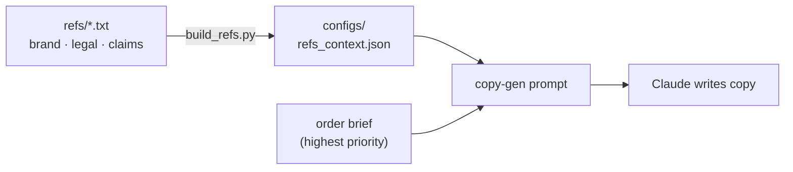

# Configuration & references

## `configs/`
| File | What it holds | Edit it when |
|---|---|---|
| `upwork_config.json` | Drive folder IDs, Figma file ID, channel/platform specs | Folders, file, or channel specs change |
| `template_registry.json` | Style → template frame mapping + per-template rules | A template moves (⚠️ currently **stale**; plugin is name-driven so lower priority) |
| `refs_context.json` | Compiled brand + legal + performance context (~140 KB) | **Never by hand** — it's generated |

## How references reach the copy



## The references pipeline (`refs/` → `build_refs.py` → `refs_context.json`)
The AI's brand/legal/voice knowledge is **compiled**, not hand-written into the config:

```
refs/*.txt  ──(pipeline/build_refs.py)──▶  configs/refs_context.json  ──▶  copy-gen prompt
```

To change what the copy-gen "knows":
1. Edit the raw docs in `refs/` (brand voice, writing style, compliance, approved claims, copy bank,
   prospecting/retargeting examples, KOTH performance, photo tags).
2. Run `python3 pipeline/build_refs.py`.
3. The recompiled `refs_context.json` is picked up on the next run.

> TODO: list each `refs/*.txt` file and the `context` key it populates (brand_voice, writing_style,
> compliance, approved_claims, smb_copy_bank, prospecting_examples, …) so editors know which file drives what.

## Drive folders (from `upwork_config.json`)
- **Brand:** `1Jn42lIOVAir9QU-PAMGnDmO8gMsz6BGA`
- **Sprints (review queue):** `1YpFoiUadL3pguWDJ_Uu4dasek1dj-mLY`
- **Approved:** `1OO2Yg7n1E5UhTw3cEJ9mUN_GF0I5xnKv`

## Figma
- **File:** `DoDwumxELkuAuKKSP5p00e` ("Paid Acquisition 2026")
- **Template Library:** the ⚙️ Template Library page holds the 21 ad-type templates.
- **Photo library:** rights-cleared, tagged photos read live by `pipeline/figma_library.py` (tags are hidden
  rectangles on nodes; rights via a `rights_YYYY_MM` pattern). See [Constraints](10-constraints.md).

## Layer-naming convention
Per-style unique, mountain-peak-with-underscores names (e.g. `PhotoWithText_Headline_Text`,
`Left_Headline_Text`) — no generic cross-template `headline_text` that would collide. The plugin's lookup
tables encode these; see [Figma plugin](05-figma-plugin.md).
