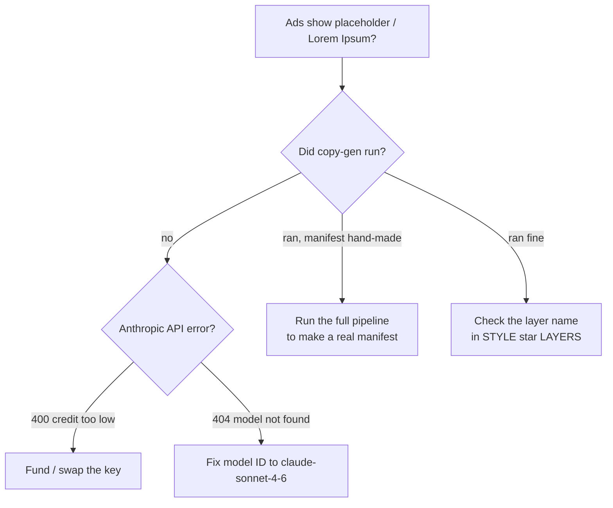

# Troubleshooting

## Blank copy? Follow the tree



## Copy comes out blank / "Lorem Ipsum" / ads look like bare templates
**Most likely:** copy-gen never ran. Two causes:
1. **Anthropic key has no credits.** Copy-gen returns **HTTP 400 `"Your credit balance is too low to access
   the Anthropic API."`** (Note: 400, not 401 — it *looks* like a bad request.) Fix: fund the account or set
   a funded `ANTHROPIC_API_KEY` (locally in `.env` **and** in Railway env), then re-run from Gate 2.
2. **You fed the plugin a hand-written/sparse manifest** (no AI copy). Uniqueness comes from the **copy-gen
   stage**, not the plugin. Run the full pipeline to produce a real `asset_manifest.csv`, then assemble.

Quick check:
```bash
python3 - <<'PY'
import httpx
key=[l.split('=',1)[1].strip().strip('"') for l in open('.env') if l.startswith('ANTHROPIC_API_KEY=')][0]
r=httpx.post("https://api.anthropic.com/v1/messages",
  headers={"x-api-key":key,"anthropic-version":"2023-06-01","content-type":"application/json"},
  json={"model":"claude-sonnet-4-6","max_tokens":20,"messages":[{"role":"user","content":"OK"}]})
print(r.status_code, r.text[:200])
PY
```

## `ModuleNotFoundError: No module named 'httpx'`
Copy-gen imports `httpx` directly. Install it in the runtime (`pip install httpx`, or add to
`requirements.txt` / `pyproject.toml`). On a PEP-668 system Python, use a venv or `--break-system-packages`.

## Plugin doesn't see my code change
The plugin has **no hot reload**. Re-run it in Figma desktop; if it was relinked, re-import
`plugin/manifest.json`.

## A style assembles but fills nothing
The style's configured `Template_*` frame may be an **empty skeleton**, or the container name is wrong.
Confirm the **Adtype container** name and the **template frame that actually has text layers**, then fix the
`STYLE_*` lookup tables in `plugin/code.js`. (This was the Testimonial bug — it pointed at empty
`Template_TestimonialB`; fixed to `Template_TestimonialC` in container "Adtype: Testimonial Variants".)

## A field stays placeholder even when copy exists
The fill is targeting the wrong layer, or the layer name differs in the chosen component-set variant. Inspect
the template's real layer names (`pipeline/inspect_templates.py` or the Figma API) and update the candidate
list in the relevant `STYLE_*_LAYERS` table.

## "Unknown visual_style" in the plugin log
The style isn't in `STYLE_TEMPLATE_PREFIXES`, or `normalizeStyle()` maps it to a different key than the table
uses. Add the normalized key to the lookup tables.

## Railway API token rejected / 403 from the Railway API
The project-scoped token works for GraphQL project queries, **not** the CLI's `me`/account calls. Cloudflare
also 403s requests without a browser `User-Agent` — add `User-Agent: Mozilla/5.0` to direct API calls.

## Images don't generate
Stage 04 needs **Gemini** quota. Library-fed and skip-image styles don't call Gemini at all — use those to
test the rest of the pipeline without image spend.

## Sprint created locally doesn't show up in the deployed app
`runs/` persistence differs between local and the deploy. Verify the Railway volume / shared-storage setup
(historically `runs/` was baked into the image and required a redeploy). *(Tracked in [Deployment & ops](08-deployment-and-ops.md).)*
