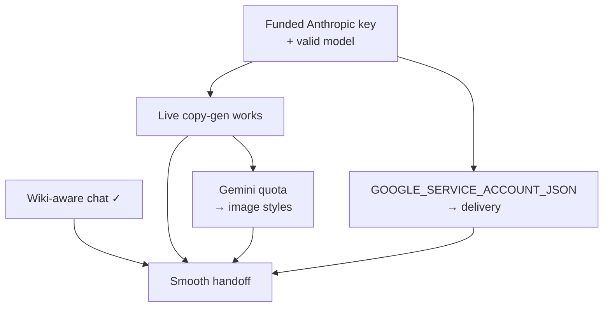

# Handoff

The goal: a new Upwork owner can run, edit, extend, and operate ADAM — and when stuck, **ask ADAM's own
chat** and get a grounded answer.

## What unblocks a clean handoff

## Stakeholders & ownership
| Person | Role | Owns |
|---|---|---|
| Logan Heath | Tech lead (CM contractor) | Pipeline, web app, chat, plugin, end-to-end integration |
| Adrie Etherington | Creative lead | Copy prompts, brand voice, curation |
| Brandon Morayo* | Motion/graphic designer | Figma templates + photo-library tagging *(registry/plugin ownership moved in-house — see note)* |
| Bree | Design producer | Production schedule, stakeholder coordination |
| Brian | Upwork CD | Veto on AI photography (source of the no-AI-photo rule) |
| Leon Zhao | Upwork architect / sponsor | Hosting decisions, InfoSec narrative, handoff support |
| Ravi Parikh | Director of AI (Wonder) | High-level architecture sign-off |
| Haresh's team | Upwork engineering | LLM Gateway, AWS Terraform, production deploy |
| Sal / Shams | Upwork InfoSec | Security review |
| Blake | CM owner | Logan's contracting entity |

> *Note: template-registry + plugin work was brought **in-house** (ship-live, no branch-for-review). Verify
> current ownership of the Figma templates with Logan/Bree.

## What's done
- Pipeline runs end-to-end through all 6 gates.
- Web app (order form + dashboard + chat) deployed on Railway.
- Plugin recognizes **all 21** templates with document-wide auto-discovery.
- Multi-field copy-gen wired (Us vs Them, Sticky Note, Pie Chart).
- In-app chat with 13 sprint/learnings tools.

## What's left (priority order)
1. **Funded Anthropic key** — *the* blocker for live unique output. Fund the account or swap the key in
   `.env` + Railway. (Then verify Gemini quota for image styles.)
2. **Push `GOOGLE_SERVICE_ACCOUNT_JSON` to Railway** — delivery stage (Drive upload) needs it.
3. **Make the chat wiki-aware** — add a `get_wiki`/`search_wiki` tool (or seed `learnings.md`) so handoff
   questions get grounded answers. See [The web app & chat](06-the-web-app-and-chat.md).
4. **Reconcile docs** — fold the stale `CLAUDE.md` status/hosting sections into this wiki; confirm Railway
   project/service names; document `runs/` persistence on Railway.
5. **Field-coverage polish** — Pie Chart quadrant labels, Photo-with-Text subhead variant, a few layer renames.
6. **Production hardening** (Upwork eng) — LLM Gateway, OAuth, audit trail, sprint state in a DB.
7. **Rotate** the Figma + Railway tokens shared during the build.

## How to get unblocked
- **Operating questions** → ask the in-app **chat** (`/chat`), or this wiki's [FAQ](12-faq.md) /
  [Troubleshooting](11-troubleshooting.md).
- **Pipeline/code** → `pipeline/run_pipeline.py` is the source of truth; `learnings.md` has hard-won lessons.
- **Constraints** → [Constraints](10-constraints.md) before proposing infra changes.
- **People** → table above.

## Handoff checklist
- [ ] Funded Anthropic key live (local + Railway) and copy-gen verified end-to-end
- [ ] Gemini quota confirmed; an image-style sprint generated successfully
- [ ] `GOOGLE_SERVICE_ACCOUNT_JSON` set on Railway; delivery stage verified
- [ ] Chat made wiki-aware; team can ask "how is ADAM built?" and get a cited answer
- [ ] Tokens rotated; secret access transferred to Upwork-owned accounts
- [ ] Railway project access transferred to the inheriting team
- [ ] A live walkthrough recorded (order → gates → assembly → delivery)
