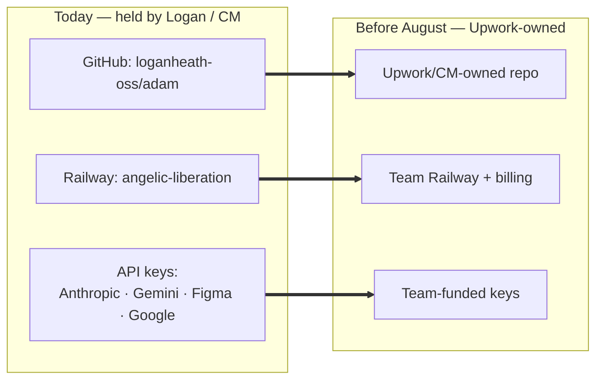
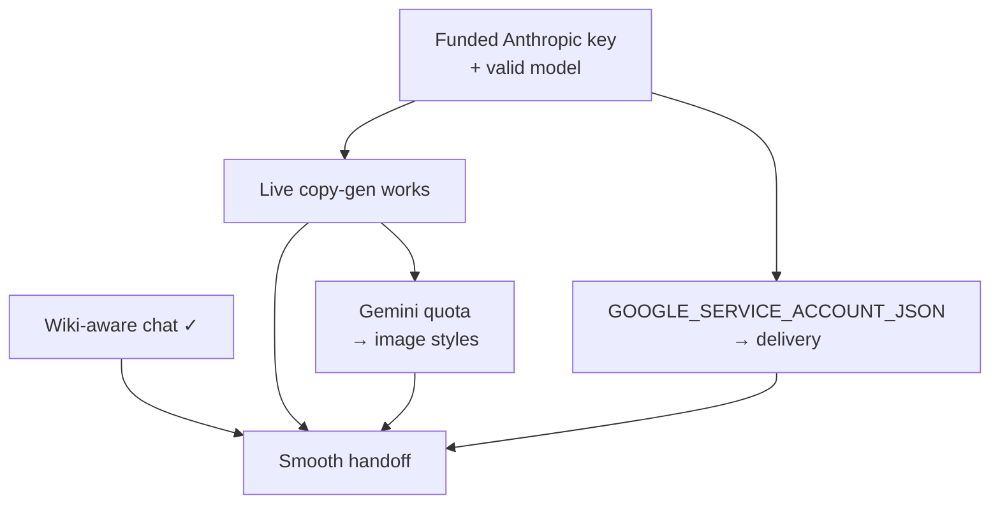

# Handoff

The goal: a new Upwork owner can run, edit, extend, and operate ADAM — and when stuck, **ask ADAM's own
chat** and get a grounded answer.

## Access & ownership — what is tied to Logan/CM and MUST transfer

**The wiki's *knowledge* is 100% portable — nothing here needs Logan's laptop.** The local `~/...` paths
in the runbooks are just *one* clone of the repo; any machine that clones it works the same. What the
*running system* depends on is a short list of **accounts and keys** currently held by Logan or CM. Move
these and the team is fully self-sufficient:

| Asset | Held by today | What it powers | Action before August |
|---|---|---|---|
| GitHub repo `loganheath-oss/adam` | Logan's GitHub | Canonical source; Railway deploys from it | **Transfer or fork to an Upwork/CM org**, then repoint Railway's deploy source |
| Railway project `angelic-liberation` (service `adam`) | Logan/CM Railway | Hosts the live tool + its env vars | **Transfer the project + billing** to the team's Railway account |
| `ANTHROPIC_API_KEY` (Railway env) | current funded account | Copy-gen + Ask ADAM chat | Swap in the **team's own funded Anthropic key** |
| `GEMINI_API_KEY` | current account | Image generation (stage 04) | Swap in the team's own funded Gemini key |
| `FIGMA_ACCESS_TOKEN` | Logan's read token | Library photo lookup | Replace with a team token *(the Figma **file** is already Upwork-owned)* |
| `GOOGLE_SERVICE_ACCOUNT_JSON` | not yet set | Delivery (Drive upload) | Provision under a **team Google account** + set on Railway |
| Drive folders (Brand / Sprints / Approved) | current Google account | Sprint inputs/outputs | Confirm team access or move the folders |
| `PIPELINE_API_KEY` (Railway env) | not yet set | Login for `/sync-log`, `/learnings`, sprint admin | Set a value the team holds |
| Adrie's Claude Project (copy curation) | Adrie | Copy-prompt tuning | Person-owned — confirm continuity or migrate into `refs/` |

> Everything **else** — the code, the wiki, the Figma file, the live URL — is already usable as-is. The list
> above is the *entire* dependency surface. Nothing depends on Logan being reachable once these have moved.

> **Migration status (2026-06-26):** underway — **John Papus** (Upwork) is directing the initial steps to move
> ADAM into an Upwork-owned space; Logan is coordinating IT access (**Zscaler / Okta**, machine/VM config) with
> **Mike Leon** via Slack.

## What unblocks a clean handoff

## Stakeholders & ownership
| Person | Role | Owns |
|---|---|---|
| Logan Heath | Tech lead (CM contractor) | Pipeline, web app, chat, plugin, end-to-end integration |
| Adrie Etherington | Creative lead | Copy prompts, brand voice, curation |
| Breanna Hovan (Bree) | Design producer | Templates + production; confirmed all templates incorporated into ADAM |
| Adrie + Elise | Creative / design | Bespoke + illustration templates (now complete); Figma feature investigation |
| Brandon Morayo* | (former) motion/graphic | Original Figma templates *(work complete; ownership moved in-house — see note)* |
| Brian | Upwork CD | Veto on AI photography (source of the no-AI-photo rule) |
| Leon Zhao | Upwork architect / sponsor | Hosting decisions, InfoSec narrative, handoff support |
| Ravi Parikh | Director of AI (Wonder) | High-level architecture sign-off |
| Haresh's team | Upwork engineering | LLM Gateway, AWS Terraform, production deploy |
| John Papus | Upwork | Directing the infra migration into an Upwork-owned space |
| Mike Leon | Upwork IT | Access setup — Zscaler / Okta, machine/VM config (via Slack) |
| Sal / Shams | Upwork InfoSec | Security review |
| Blake | CM owner | Logan's contracting entity |

> *Note: template-registry + plugin work was brought **in-house** (ship-live, no branch-for-review). Verify
> current ownership of the Figma templates with Logan/Bree.

## What's done
- **All templates complete** — remaining + bespoke + illustration templates incorporated into ADAM (confirmed 2026-06-26).
- Pipeline runs end-to-end through all 6 gates.
- Web app (order form + dashboard + chat) deployed on Railway.
- Plugin recognizes **all 21** templates with document-wide auto-discovery.
- Multi-field copy-gen wired (Us vs Them, Sticky Note, Pie Chart).
- In-app chat with 15 tools (13 sprint/learnings + 2 wiki).

## What's left (priority order)
1. ✅ **Live copy-gen verified (2026-06-29).** A 5-style sprint generated **30 real, on-brief concepts** on
   the Railway key — the original "make unique copy" blocker is resolved. (It was a dead model ID,
   `claude-sonnet-4-20250514` → `claude-sonnet-5`; the Railway key clears billing, only the local `.env`
   key is empty.) Remaining: drive it through the **web UI gates** end-to-end (needs `PIPELINE_API_KEY` set).
2. **Confirm Gemini quota** for image styles, then run an image-style sprint.
3. **Set `GOOGLE_SERVICE_ACCOUNT_JSON` on Railway** — delivery stage (Drive upload) needs it.
4. **Transfer ownership** per the table above (repo, Railway, keys) — the real handoff work.
5. **Field-coverage polish** — Pie Chart quadrant labels, Photo-with-Text subhead variant, a few layer renames.
6. **Production hardening** (Upwork eng) — LLM Gateway, OAuth, audit trail, sprint state in a DB.
7. **Rotate** the Figma + Railway tokens shared during the build.

✅ *Already done this build:* in-tool wiki, **wiki-aware Ask ADAM chat** with clickable sources, all 21
templates recognized, multi-field copy-gen, the dead-model-ID fix.

## How to get unblocked
- **Operating questions** → ask the in-app **chat** (`/chat`), or this wiki's [FAQ](12-faq.md) /
  [Troubleshooting](11-troubleshooting.md).
- **Pipeline/code** → `pipeline/run_pipeline.py` is the source of truth; `learnings.md` has hard-won lessons.
- **Constraints** → [Constraints](10-constraints.md) before proposing infra changes.
- **People** → table above.

## Handoff checklist
- [x] Wiki-aware Ask ADAM chat live; team can ask "how is ADAM built?" and get cited answers
- [x] Live copy-gen verified — 30 concepts generated on the Railway key (5-style test sprint, 2026-06-29)
- [ ] Gemini quota confirmed; an image-style sprint generated successfully
- [ ] `GOOGLE_SERVICE_ACCOUNT_JSON` set on Railway; delivery stage verified
- [ ] **GitHub repo moved to an Upwork/CM org**; Railway deploy source repointed
- [ ] **Railway project + billing transferred** to the inheriting team
- [ ] API keys swapped to **team-funded accounts**; build-time tokens rotated
- [ ] `PIPELINE_API_KEY` set on Railway (lights up `/sync-log`, `/learnings`, sprint admin)
- [ ] A live walkthrough recorded (order → gates → assembly → delivery)
