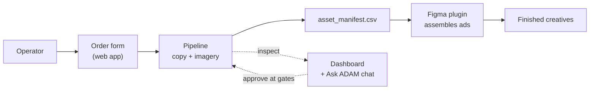

# ADAM Wiki — Home

> **ADAM** is the AI-assisted creative production pipeline for Upwork's Paid Acquisition team.
> It takes a brief and produces ad **copy + assembled static creatives** across multiple sizes
> and visual styles — replacing manual concepting and Figma assembly for batch ad production.

This wiki is the **single source of truth** for understanding, running, operating, and inheriting
ADAM. If something here contradicts an older doc (e.g. the root `CLAUDE.md` still mentions Fly/Replit),
**this wiki wins** — see [Known doc drift](#known-doc-drift).

---

## 🗺️ The whole system at a glance

## 🚦 Status at a glance

| Thing | State |
|---|---|
| Local pipeline (`run_pipeline.py`) | ✅ Runs end-to-end through all 6 gates |
| Web app (`main.py`: order form + dashboard + chat) | ✅ Deployed on **Railway** (auto-deploy from GitHub) |
| In-app AI chat (`agent/`) | ✅ Live — Claude tool-use loop over sprints + learnings |
| Figma assembly plugin | ✅ Recognizes **all 21** templates; auto-discovers templates across the file |
| Copy generation (Claude) | ⛔ **Blocked** — Anthropic API key has $0 credit balance (see [Troubleshooting](11-troubleshooting.md)) |
| MCP server (`mcp_server/`) | 🟡 Exists (Fly config in repo); superseded by the web app for day-to-day use |
| Production hardening (LLM Gateway, OAuth, audit) | ⏳ Pending — owned by Upwork eng |

> ⚠️ **The one thing blocking unique output today** is a funded **Anthropic API key**. Everything
> else is wired. The moment a key with credits is in place, copy-gen runs and the live tool
> produces real, on-brief ads instead of bare templates.

---

## 📖 Read in this order

**New to ADAM? Start here:**
1. [What is ADAM](01-what-is-adam.md) — the what, the why, who it's for
2. [Architecture](02-architecture.md) — how the pieces fit, end to end
3. [Repo map](03-repo-map.md) — where every file lives (and what's historical)

**Want to run it / operate it:**
4. [Using ADAM](07-using-adam.md) — operator runbook: order → gates → Figma → delivery
5. [The pipeline](04-the-pipeline.md) — stages 00–06 and the gate model
6. [The Figma plugin](05-figma-plugin.md) — assembling creatives from a manifest
7. [The web app & chat](06-the-web-app-and-chat.md) — order form, dashboard, "ask ADAM anything"

**Operating, fixing, owning:**
8. [Deployment & ops](08-deployment-and-ops.md) — Railway, secrets, redeploys
9. [Configuration & references](09-configuration-and-refs.md) — configs/, refs/, registries
10. [Constraints](10-constraints.md) — the non-negotiable guardrails
11. [Troubleshooting](11-troubleshooting.md) — known failures and fixes
12. [FAQ](12-faq.md) · [Glossary](13-glossary.md)
13. [Handoff](14-handoff.md) — stakeholders, ownership, what's left
14. [Decisions log](15-decisions-log.md) — load-bearing history

---

## 🤖 This wiki feeds the chatbot

The "ask the tool any question and get an answer" goal is served by the in-app chat
(`agent/orchestrator.py`). That assistant already reads [`learnings.md`](../../learnings.md)
on every session. **Plan:** this wiki becomes a knowledge source the chat can cite, so a new
team member can ask *"how do I add a new visual style?"* or *"why is copy blank?"* and get a
grounded answer. See [The web app & chat → Making the wiki answerable](06-the-web-app-and-chat.md).

---

## Known doc drift

These are accurate as of this wiki; older docs lag:

- **Hosting is Railway**, not Fly and not Replit. `main.py`'s header still says "Replit entry point"
  and `mcp_server/fly.toml` still exists — both are historical. Replit POC lives in `replit-poc/` (retired).
- **`CLAUDE.md`** (root) is the original master spec. Still useful for decisions/constraints, but its
  "Status / Architectural direction" sections predate the Railway migration and the web-app + chat build.
- **AWS / Terraform** (`terraform/`) is dormant scaffolding — see [Constraints](10-constraints.md) (no native AWS).

> **Maintainers:** when you change how ADAM works, update the relevant wiki page in the same PR.
> A stale wiki is worse than no wiki because the chatbot will repeat it.
